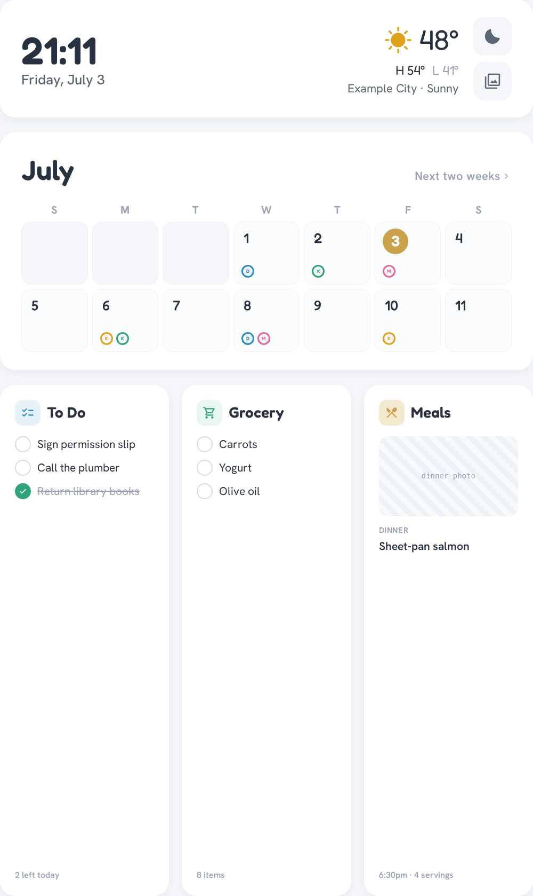

# OpenFamHub

[](LICENSE)

**A subscription-free, self-hosted family dashboard for a wall-mounted touchscreen.**

A unified color-coded calendar, chores/routines with a real points-and-rewards
economy, meal planning + recipes + a shared grocery list, weather, a budget snapshot,
a family journal, and a companion mobile PWA — pulling from tools you probably already
use (Todoist, Google/iCloud calendars, [Mealie](https://mealie.io), Monarch Money)
instead of asking your family to adopt a new app. No monthly fee, no cloud account:
your data lives on your own hardware.

📖 **[Full documentation](https://alitarraf.github.io/openfamhub/)**



## Quick start

```bash
git clone https://github.com/alitarraf/openfamhub.git
cd openfamhub

cp .env.example .env        # optional — runs in demo mode with everything blank
docker compose up -d --build

# Wall:           http://localhost:8080
# Companion PWA:  http://localhost:8080/m
```

Every screen falls back to bundled demo data when its source isn't configured, so it's
fully browsable out of the box. See **[Get Started](https://alitarraf.github.io/openfamhub/install)**
for wiring up real accounts (Todoist, a calendar feed, Mealie, weather).

## What's in the docs

- **[Get Started](https://alitarraf.github.io/openfamhub/overview)** — overview, hardware, install, first-time setup
- **[Hardware](https://alitarraf.github.io/openfamhub/hardware)** — the thin client, touchscreen, and wall mount (the reference ~$140 build)
- **[Networking](https://alitarraf.github.io/openfamhub/networking)** — reaching it safely from phones over Tailscale
- **[User Guide](https://alitarraf.github.io/openfamhub/guide/overview)** — every screen, explained
- **[Integrations](https://alitarraf.github.io/openfamhub/integrations/todoist)** — Todoist, calendar, Mealie, weather, budget
- **[API reference](https://alitarraf.github.io/openfamhub/reference/api)** — the full OpenAPI spec (also served live at `/api/docs`)
- **[Deployment](https://alitarraf.github.io/openfamhub/self-hosting)** — Docker Compose + turning a thin client into a wall kiosk

## Behind the project

Existing options were either a paid subscription (Skylight, DAKboard), tied to one
ecosystem, or — like MagicMirror² — a passive display dashboard that can't do the
*application* behavior a real family command center needs: per-person point balances,
reward redemption that actually persists, tap-to-complete that writes back to the
source of truth. This is a standalone app built around that gap: a lean Svelte
frontend, a small Express backend that aggregates a handful of self-hosted/free
services, and a first-party points economy as the one genuinely new piece of backend
state.

This project's implementation was built with [Claude Code](https://claude.com/claude-code) —
requirements, architecture decisions, and design direction were human-directed; Claude
Code did the implementation, refactoring, and testing.

## Contributing

Issues and PRs welcome. If you're missing an integration (a different task manager, a
different calendar source), the [provider registry](https://alitarraf.github.io/openfamhub/reference/api)
is designed so adding one is a new file implementing the same exported functions as
its neighbor, plus a one-line registry entry — not a fork.

## License

[MIT](LICENSE) — free for personal and commercial use.

## Acknowledgments

Built with [Claude Code](https://claude.com/claude-code), and indebted to the
self-hosting community this kind of project lives in.
